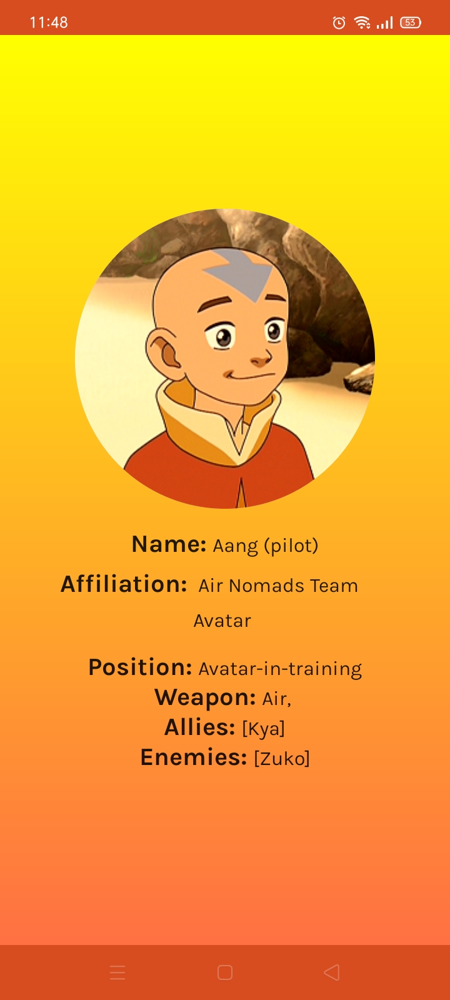

# Avatar animation android app

Avatar is a sample android app that showcases how to use various libraries in android.
It is a good project for reference if you are getting started with MVVM architecture and jetpack compose for building UI.

To try out this sample app, use the latest stable version
of [Android Studio](https://developer.android.com/studio).
You can clone this repository or import the
project from Android Studio following the steps
[here](https://developer.android.com/jetpack/compose/setup#sample).

### Status: 🚧 In progress 🚧

Avatar the last air Bender is still in development, two screens have been implemented so far, HomeScreen displays all
characters based on their nation, Details screen displays the details of these characters. The plan is to add another API to display various episodes.

## Screenshots

## Features

This app contains two features so far implemented in form of screens. Characters screen and CharacterDetails screen.

Characters screen - build with jetpack compose, displays various characters based on their nation i.e fire, water, earth, air and also avatars.
this screen consumes flows emitted from a useCase.

CharacterDetails screen - Displays the details of a specific character.
